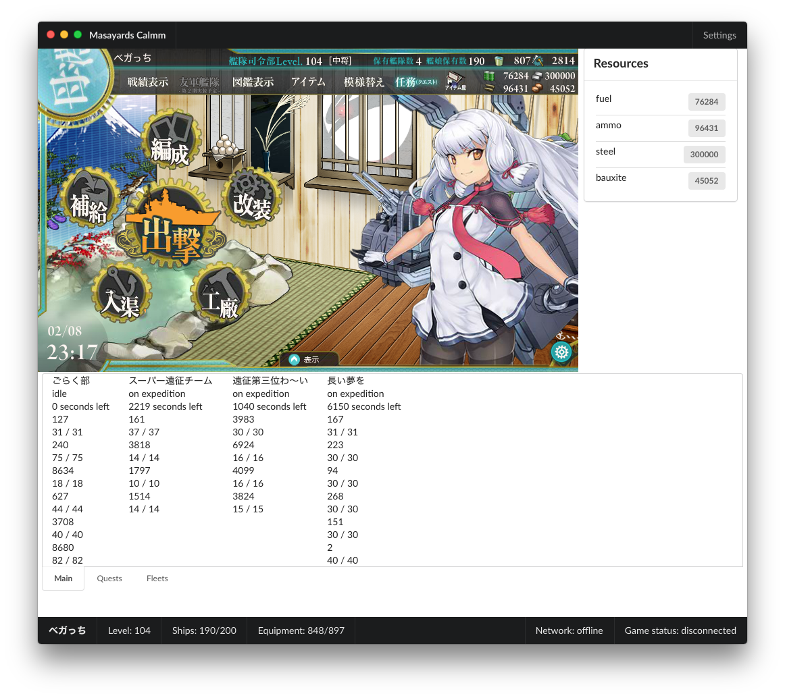

[](https://travis-ci.org/stuf/masayards-calmm)
[](https://ci.appveyor.com/project/stuf/masayards-calmm)
[](https://codecov.io/gh/stuf/masayards-calmm)

# Masayards (Calmm)

A Kancolle (艦隊これくしょん) viewer client created with [Electron](https://electron.atom.io) and [Calmm](https://github.com/calmm-js).



I believe this is a fitting and maybe a little bit unusual of a test case for creating an Electron-based application. There's a whole lot of data that comes from a pretty inconsistent API. Joy!

## Development

Check out the [`docs`][documentation] folder for documentation on the application, API reference, how the API life cycle is handled, how the UI is structured and more.

[documentation]: docs/

### Requirements

 * [`yarn`][yarnpkg]

[yarnpkg]: https://yarnpkg.com

```
yarn install && yarn run dev
```

---

If you have input on these things, [hit me up on Twitter][@piparkaq] or [create an issue][issues] of your thoughts.

[@piparkaq]: https://twitter.com/piparkaq
[issues]: issues/

---

## Known issues

 * **OSX** - placing the main window in a screen with a different pixel density may cause blurriness in the game.
 * Packaging the app does not include the `PepperFlashPlugin` required for the app function correctly (used in the `webview`), which results in the application terminating right after startup.

## Acknowledgements

 * [Vesa Karvonen](https://github.com/polytypic) for excellent and insightful input and suggestions on practices.
 * chentsulin's excellent [electron-react-boilerplate](https://github.com/chentsulin/electron-react-boilerplate) for a nice base to build an Electron application on.
