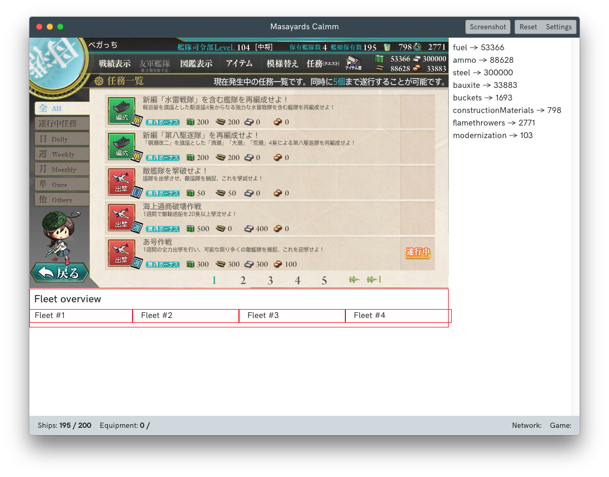

# Masayards (Calmm)

Attempt at creating a sane(r) Kancolle viewer client by using [Calmm](https://github.com/calmm-js/documentation) as inspiration,
and using a minimal React stack to avoid a huge mess of boilerplate code.

## To-do
 
 * Enable VS Code debugger integration with main and renderer process
 * Improve handling of data to conform to the initial state spec
   * `L.define` and `L.required` to the rescure, FYI
 * Clean up network event handling code
 * Improve type definition docs

## Known issues

 * **OSX** - placing the main window in a screen with a different pixel density may cause blurriness in the game.

## Acknowledgements

 * Thanks to chentsulin's excellent [electron-react-boilerplate](https://github.com/chentsulin/electron-react-boilerplate) for a nice base to build an Electron application on.
